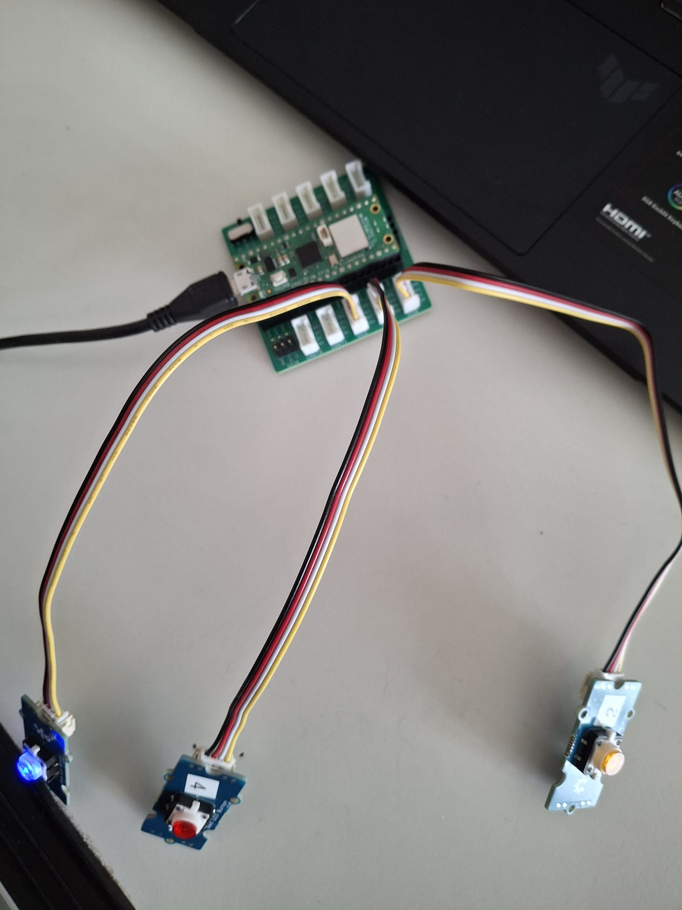

# Manual - `ReactClicker`

- Needed:
    - Three "Ledbuttons" (Red, Blue, Orange)
    - One-Pico-W
    -  Put:
        - `Orange` -> `D20`
        - `Red` -> `D18`
        - `Blue` -> `D16`

- Build (very important):  
  

# **HOW TO PLAY:**
- Needed Hardware: RasperryPi-PICO, Three Buttons (blue, red and orange)
- Needed Software: Node.js, VSCode, ArduinoIDE
- Needed Libraries: `Arduino.h` (in the Sketch there is only "Arduino-Core", so you don´t need any extra `C`-libraries), node
- Note: Don´t forget to install `Node.js` and the necessary Node-Modules for the `express.js`-Server
- Short: First start Webserver, then the PICO-Application
    - Put Buttons on correct Pins: BlueButton on `D16`, RedButton on `D18` and OrangeButton on `D20`
    - Start Webserver--> `node express.js` --> Open up `http://localhost:3000` on your Browser
    - Start PICO W --> Press BOOTSEL, put USB into your Laptop-Port, put Sketch (the analogue one) into your "ARDUINO-IDE" and upload it.
    - PLAY!
