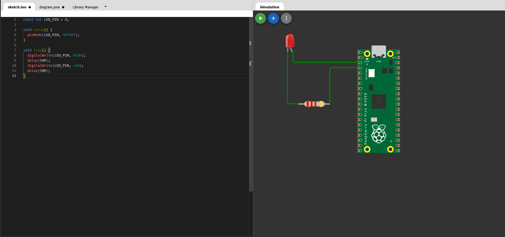

# Project Diary - `Moser`

## 23.2.2026(Day1):
- Creating a concept/Milestones/... (organisational matters) for the project

## 2.3.2026(Day2):
- Distribution of tasks
- Used-AI: `ChatGPT` --> **"Welche Bibliotheken gibt es für RasperryPi (Pico) in C?"**
- Started with first trys on WOKWI
- Abspeicherung WOKWI
  