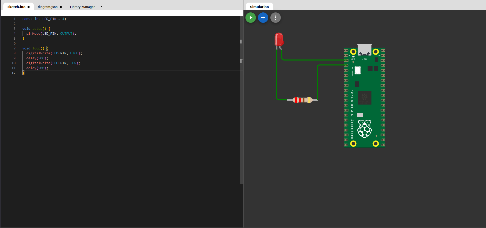

# Project Diary - `Moser`

## 23.2.2026(Day1):
- Creating a concept/Milestones/... (organisational matters) for the project

## 2.3.2026(Day2):
- Distribution of tasks
- Used-AI: `ChatGPT` --> **"Welche Bibliotheken gibt es für RasperryPi (Pico) in C?"**
- Started with first trys on WOKWI
- Abspeicherung WOKWI
  

## 9.3.2026(Day3):
- Prototype solution on Pico W + Arduino (TODO: Why does the blueLED not completely turn off)
- Completion of Website by Marcel  

## 20.04.2026(Day4):
- Created a timer for the Arduino-Sketch
- Used-AI: `ChatGPT`:
    - Wie kann ich konkret von einem Pico W Daten zu einer Website schicken (einen int z.B.)?
    - Konkret, braucht die Website eine Rest-API, und ich auch?
    - Hier ist mein Arduino-Sketch: **mein Sketch** wie geht es jetzt weiter?
    - Wie würde man jetzt aber für den Server in diesem Sketch weitermachen (was muss er können)?
    - Wie kann ich einen Timer machen? Also alle 5 Sekunden leuchtet blau für 3 Sekunden auf und das ganze 15 Sekunden lang.
    - Wie kann ich in der Arduinokonsole ausgeben? 

## 27.04.2026(Day 5): 
- Serial interface -> Pico communicates its Data to the Website
- Server puts the Data correct onto the Website

## 04.05.2026(Day 6):
- Website --> Done
- C-Sketch --> Done
- Webserver --> Done
- Used-AI: `ChatGPT`:
    - Wie schicke ich jetzt aber konkret die Daten von C rüber in z.B. JS?
    - Wie starte ich den Server?
    - Die C Rest-API muss aber in den Sketch oder?
    - Bitte kommentiere den Pico W Code vollständig.
    - Bitte kombiniere jetzt den Code vom PICO-W mit der Spiele-Logik: **mein Sketch**
    - Bitte erstelle mir eine einfache Webseite um die Werte vom Counter darzustellen.
    - Kann man die Daten vom PICO auch anders als über WLAN zu versenden?
    - Bei uns ist folgender Fehler `Failed uploading: uploading error: exit status 1`
    - Wie kann man den Server so umprogrammieren, das man ihn starten kann OHNE das der PICO schon angehängt ist (weil sonst wirft er eine Exception und sagt er kann `COM 4` nicht finden)?
    - Bitte ändere diese Webapp jetzt so das der Score in den beiden Boxen angezeigt wird: **WebAPP**
    - Wie kann ich zwei verschiedene Counter verschicken/ beziehungsweise auf der Webseie annehmen/verarbeiten?
    - Einziges verbleibendes Problem: Es wird immer, also jeder Leuchtdurchgang bei beiden immer um 1 raufgezählt, egal ob gedrückt wurde oder nicht, woran kann das liegen? --> `INPUT_PULLUP` musste aktiviert werden
    - Hier mein Sketch (mit vielen Kommentaren): **mein Sketch** Wo liegt das Problem?
    - Wie macht man ein "der schnellste kriegt einen Punkt-System"?
    - Was genau eigentlich ist jetzt "PULLUP" ? --> Ein Pull-Up-Widerstand --> Eingangspin hat definierten Zustand auch wenn nichts angeschlossen ist.
    - Was ist `millis()` ? --> Wie viele Sekunden seit Programmstart vergangen sind.
    -   1. Stimmt das so: **WebAPP JavaScript-Code** 
        2. Wie kann ich das Spiel beenden?

## 10.05.2026(Day 7):
- Removed restart
- checked if Software works properly
- Used-AI: `ChatGPT`:
    - `AdafruitBusIO` ist die einzige Bibliothek die man hier braucht oder? --> Nein, man braucht gar keine (`Arduino.h`-Core reicht aus)
- **PROJECT FINISHED**